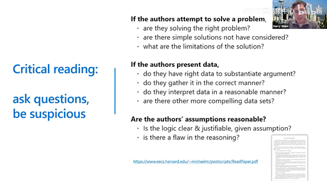
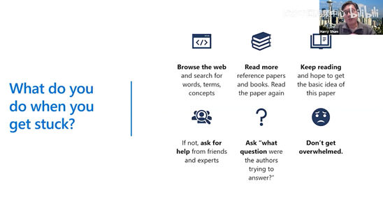
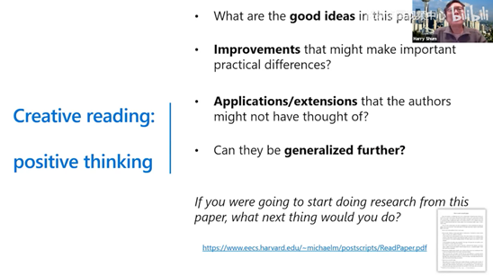
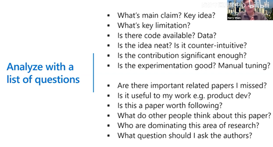
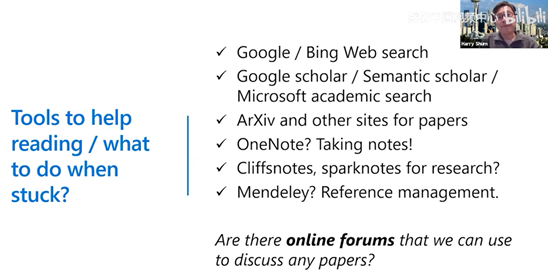
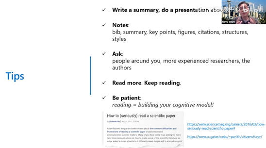

> **“或许你永远不知道你以前读过的书能在什么时候能够派上用场，但请保持阅读，因**为阅读的过程也是在你大脑中建立认知的过程。”

> **“深度阅读论文，要敢于对论文质疑，质疑论文作者的研究方法、思路、技巧。还要设身处地去想：如果我来写这篇论文，我能用什么方法。”**

> 在研究生院读书是人生中最美好的时光，在这段时间你可能没有足够的钱，但是却有足够的时间学习。
>
> 在读书的这段时间应该学习一些重要的技能，比如**有效的阅读、写作和演讲**

# 划分层次结构

> 除了阅读的方式(快速阅读、仔细阅读和创造性阅读)，读者还要**理解所读的论文是如何写出来**的。因为一篇好的论文在逻辑上是层层递进的，不仅能够传达信息也能够激励读者。所以作者在写的时候也是**有结构化的逻辑性思考程度的**。总体上**作者会思考：这篇论文的真实任务是什么、研究发现是什么；论文的贡献是什么**等等。
>
> 相应的，读者在读论文的时候也应该要有逻辑，**首先要清楚论文中的表达是否是我想要学习到的；其次，我能从论文中学到多少呢；最后，这篇论文的背景是什么——是什么样的背景让这篇论文变得重要和有趣**。

# 1 快速阅读：划分层次结构

## 1.1 论文中的表格和图片

> 只要**弄清楚论文中表格和图片的标题和注释**，就能够获得这篇论文八、九成的信息。

- 必须要理解 **这些数据如何获得的**，**每张图和表的意义**
- 看这些图和表的时候，**时刻问自己这些数据是否支持这篇文章的结论**

## 1.2 论文的标题、摘要和引言

快速阅读需要**着重关注论文的标题、摘要和引言**，如此便能了解论文是否值得读、能够从论文中读到些什么

- **标题**

  - 标题是**总结、抽象的概括**。除了论文标题，图表的标题也是非常抽象
- **摘要**

  - 读摘要的时候，**将其分解并加上一些有趣的亮点**，便可能利于阅读
  - **Background**：文章背景是什么
  - **Why**：文章工作的目的是什么
  - **How**：文章用了什么方法
  - **What**：这篇文章真正的发现是什么
  - **Conclusion**：这篇文章的研究成果是什么
- **引言：最重要也最难写的部分，** From broad topic to specific issues to focused core questions.

  - 必须要下功夫把引言写好，写到审稿人容易看懂。
  - **Background**：这篇论文是**关于什么**的，
  - **Why：** 文章工作的目的
  - **What**：解决了什么问题
  - **How：** 用的方法
  - **Novelty**：有什么**新颖的东西**，
  - **Conclusion**：为什么那么神奇（得出的**令人眼前一亮的结论**）

# 2 仔细阅读：批判思维

## How to remember

- **Content clarified** by you is yours
- Try to **summarize main points**
- Reading **like a reviewer**
- Must **be critical** about their **method and ways of thinking**

## Read effectively

- Always **summarize main points**
- Always **be critical**
- And **be creative,**

  - if their conclusion is true, what can you expect? (如果他们的结论是对的，这个结论能带来什么改变呢?)

- > 如果所读的论文没有解决问题，那么我能解决么？我能采用比论文中更简单的方法解决么？
  >
  > 所以，一旦进入仔细阅读的状态，要在读论文之前对自己说：这篇论文可能有问题，我要找出来。
  >

- 多**找一些背景知识阅读**，多**做笔记**，多**在网上搜索相关论文**，然后**再次通读所卡壳的论文**，并试着把它**与其他论文相联系起来**，如此坚持下去，定能渡过难关。
- 另一个建议是，**找熟悉这方面工作的人帮忙**，让他们解释你遇到的难点。

  - 但你要意识到找人帮忙也可能遇到困难，一方面，你要找谁帮忙，导师？师姐？学长？另一方面，如何能让他们愉快的接受你几分钟、十几分钟、甚至接近一个小时的咨询？
  - 我从他那学到的其实不光是我**应该看哪些论文，更多的是不应该看哪些论文**。他会告诉我**某人的论文你不要读，因为那会扰乱你的思路。**

# 3 创造性阅读：积极思考

> 创造性的阅读需要**把你所读的论文和其他相关的论文建立联系**，从而**产生一些新的想法**，这些想法可以支撑你进行三个月到五个月的研究。

- 这篇文章中的**好想法**
- 可能产生重要的实际差异的**改进**
- 作者没有想到的 **应用/扩展**
- 这篇文章能**被进一步推广**吗

- 关于论文阅读，可以问自己的 **客观和主观问题**
- 若能全部回答，则对本篇文章有深刻的理解

- 在阅读论文卡壳时，以上**工具**可以帮助阅读/该做什么

- 养成**写小总结**的习惯，

  - 只有把东西写下来或者说出来才能真正深刻理解
- 最好能**做报告**，这样真的能够**增加你对所读论文的理解**

  - 别人可以问你问题，这会强迫你理解所读的论文

# Refs

1. [沈向洋：读论文的三个层次 (qq.com)](https://mp.weixin.qq.com/s?__biz=MzU2OTA0NzE2NA==&mid=2247527877&idx=5&sn=3edff184812c40dc3af44c2a7c14bcde&chksm=fc868cd6cbf105c07b416bbfec4a3903b43ac1c4a2ea086025c3a7c1f3a359a3ae549574c6a4#rd)
2. [【研究生必看】如何去读一篇论文、如何去组会讲论文 &amp; 论文的笔记_哔哩哔哩_bilibili](https://www.bilibili.com/video/BV1JL4y1j7To/?spm_id_from=0.0.header_right.fav_list.click&vd_source=de5d636c079ac45214bd34891ede8c4b)
